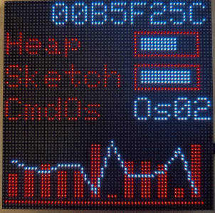

# MatrixHub
MatrixCOS - Esp32 HUB75 Matrix 64x64

develop by mk@almi.de

This Application based on <a href="http://github.com/mklossde/CmdOs">Use CmdOS V0.1.0</a>

This is a ESP32 based Applciation to display information via HUB75 Matrix display.

It a christmas projet inspired by 
	<a href='https://github.com/JPlenert/eely-hodi'>eely-HoDi Make Articel</a> 
	

##  Example show values 

	
Exmaple of displa esp values on the matrix display

<a href='example/examples.md'>Other Examples</a>

## Setup
	matrix 64 64 1 90 0 0,15,4,16,27,17,5,18,19,21,12,33,25,22
	

[<a href="libs.md">Require Libs</a>]
  
 a OpenOn.org project - develop by mk@almi.de 

