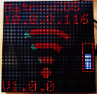
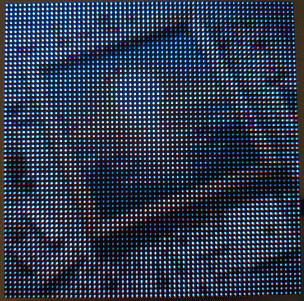

# MatrixCOS - Esp32 HUB75 Matrix

develop by mk@almi.de

If you use/like this project please <a href='http://paypal.me/openonorg<'>donate to http://paypal.me/openonorg</a> (a good choise is 1Euro per ESP a year ;-)

This Application based on <a href="http://github.com/mklossde/CmdOs">Use CmdOS V0.1.0</a>

This is a ESP32 based Applciation to display information via HUB75 Matrix display.

It a christmas projet inspired by 
	<a href='https://github.com/JPlenert/eely-hodi'>eely-HoDi Make Articel</a> 

	

## Feature 
 - <a href='doc/Commands.md'>matrix commands</a>
 - <a href='doc/Config.md'>display config</a>
 - <a href='doc/Web.md'>web control</a> 
 - <a href='doc/Mqtt.md'>mqtt control</a>
 - <a href='doc/Rest.md'>rest control</a>
 - <a href='doc/Timer.md'>autostart and timer</a> 
 - <a href='doc/Multi.md'>multi display</a> 
 - <a href='https://github.com/mklossde/CmdOs/blob/main/doc/CmdOsCmds.md'>CmdOS Commands</a>
	
## Command Examples 
<a href='example/examples.md'>command Examples</a>

##  Example show values 
	
Exmaple of displays esp values on the matrix display

##  Example disaply animated gif

## Setup
	matrix 64 64 1 90 0 0,15,4,16,27,17,5,18,19,21,12,33,25,22
	

[<a href="libs.md">Require Libs</a>]
  
 a OpenOn.org project - develop by mk@almi.de 

