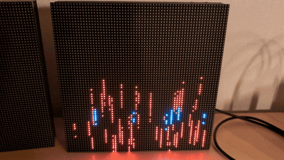

# MatrixCOS - Effect

With displayBfffer enabled, here are some effects

	

- effectType = define a effect
- effectStep = number of steps (effect stops after number of steps)
- effectSpeed = imte in ms between two steps
- effectA = effect-type attr a
- effectB = effect-type attr b

## Effect shift + matrix
- effectType=1

- effectA = shift wide x in pixel (e.g. 1=one pixel left, -2=two to right)
- effectB = shift wide y in pixel (e.g. 1=one pixel up, -1=one pixel down)

	e.g. effect 1 64 100 -1 0 => shift actual image (from buffer) to right 

## Matrix shift
- effectType=1
- effectA >5 or <-5 - matrix/random shift (>5 to left, <5 to right)		
- effectA >5 or <-5 - matrix/random shift (5 matrix shift up, -5 matrix shift down)

	e.g. effect 1 64 100 0 -5 
 
	
 a OpenOn.org project - develop by mk@almi.de 