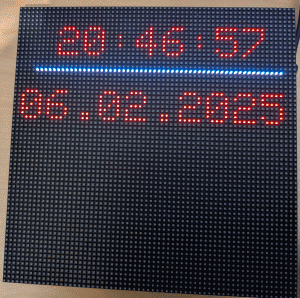
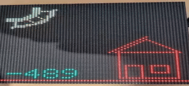
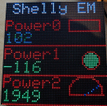
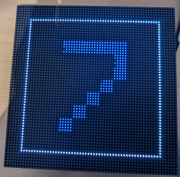
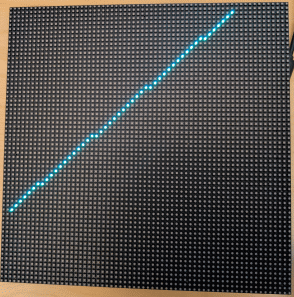

# MatrixHub - prg Examples 

## Time and Date clock

Draw a count-down - <a href='TimeDateClock.cmd'>TimeDateClock.cmd</a>

## solor

receive information via MQTT and show as solar energy
<a href='solar.cmd'>solar.cmd</a>

## shelly

receive information from shelly
<a href='shellyEM.cmd'>shellyEM.cmd</a>

## Counter 

Draw a count-down - <a href='counter.cmd'>counter.cmd</a>

## line bounce

draw a bouncing line  <a href='counter.cmd'>line_bounce.cmd</a>

## random color
draw random colors <a href='counter.cmd'>randomColor.cmd</a>

## chart
draw a chart  <a href='chart.cmd'>chart.cmd</a>

