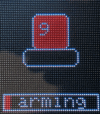
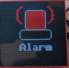
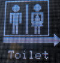
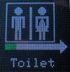
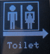
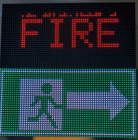
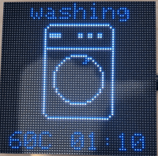
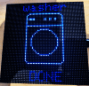
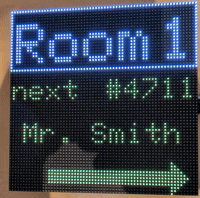

# MatrixHub - prg Examples 

## Time and Date clock

Draw a count-down - <a href='TimeDateClock.cmd'>TimeDateClock.cmd</a>

## alarm sign
  
draw alarm sign  <a href='alarm.cmd'>alarm.cmd</a>

## toilet sign
  
 
draw toilet sign  <a href='signToilet.cmd'>signToilet.cmd</a>

## Fire and Exit

draw fire and exit sign  <a href='fireAndExit.cmd'>fireAndExit.cmd</a>

## Digital wash information
 
washer example  <a href='wash.cmd'>wash.cmd</a>
(e.g. use by read $m from tasmota or shelly plug and show wash if acutal power > 10 and done if actual power < 5)

## Room

Next please in room X  <a href='room.cmd'>room.cmd</a>

## solor

receive information via MQTT and show as solar energy
<a href='solar.cmd'>solar.cmd</a>

## shelly

receive information from shelly
<a href='shellyEM.cmd'>shellyEM.cmd</a>

## Counter 

Draw a count-down - <a href='counter.cmd'>counter.cmd</a>

## line bounce

draw a bouncing line  <a href='counter.cmd'>line_bounce.cmd</a>

## random color
draw random colors <a href='counter.cmd'>randomColor.cmd</a>

## chart
draw a chart  <a href='chart.cmd'>chart.cmd</a>

